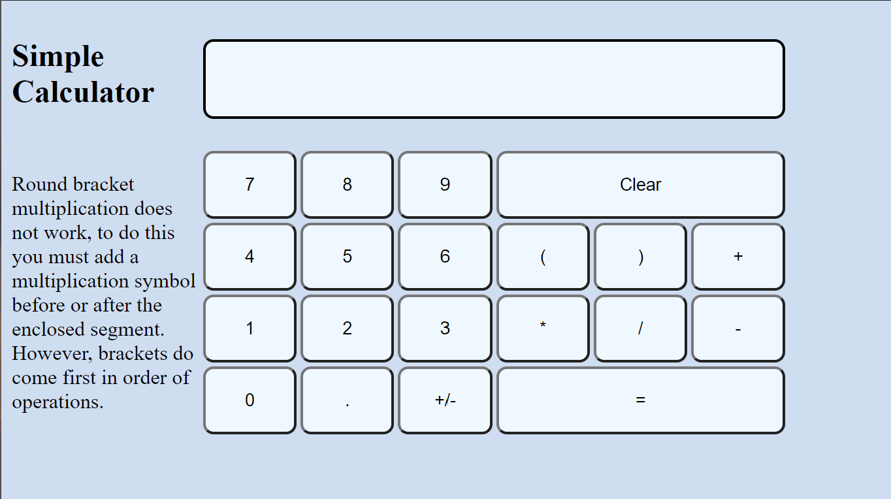

# Simple Calculator

Eventually this will be a simple calculator, but for now it is in it's early stage.  

So far I have:
- used css to organize the buttons and display
- built a basic set of buttons
- buttons type out equation
- "=" sign evaluates and shows answer
- moderate styling
- it looks like this:
  
  
I am currently working on:
- remembering most recent answer and adding ans button
- displaying equation history below
- keyboard operation